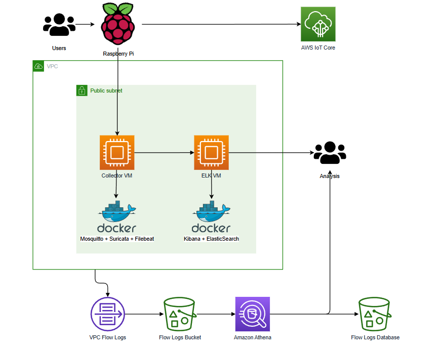

# IoT Security: Multi-Layer Threat Detection using Suricata & VPC Flow Logs

## Project Overview

This project implements a comprehensive, multi-layered security monitoring architecture designed to detect and analyze threats targeting Internet of Things (IoT) environments. Utilizing an **Infrastructure-as-Code (IaC)** approach with **Terraform** and **Docker**, the system automates the deployment of a dual-path monitoring framework on AWS to inspect MQTT traffic generated by a Raspberry Pi IoT device.

The architecture addresses security visibility through two distinct analytical layers:

1.  **Deep Packet Inspection (Layer 7):** A dedicated EC2 Collector instance hosts the **Suricata** Intrusion Detection System (IDS). By monitoring mirrored MQTT traffic from the IoT device, Suricata applies custom signature-based rules to detect specific payloads, including simulated Distributed Denial of Service (DDoS) attacks, malformed JSON injections, and protocol anomalies. These high-fidelity alerts are shipped via **Filebeat** to a separate **ELK Stack** (Elasticsearch and Kibana) server, enabling real-time visualization of threat content.
2.  **Network Traffic Analysis (Layer 3/4):** To complement content inspection, the project leverages cloud-native logging via **AWS VPC Flow Logs**. Network metadata—including source IPs, destination ports, and packet volumes—is routed directly to **Amazon S3** storage. **Amazon Athena** is configured as a serverless query engine to perform behavioral analysis on this data, successfully identifying volumetric attacks and port scanning patterns based on metadata alone, independent of packet payload.

## Architecture



The system consists of two primary EC2 instances orchestrated via Docker Compose:

  * **Collector VM (t2.medium):**
      * **Mosquitto:** Acts as the MQTT broker for the IoT device.
      * **Suricata:** Sniffs traffic on the host interface (`eth0`) to detect threats.
      * **Filebeat:** Ships Suricata alerts (`eve.json`) to the ELK stack.
  * **ELK Stack VM (t2.medium):**
      * **Elasticsearch:** Stores and indexes log data.
      * **Kibana:** Provides a web interface for visualizing alerts and creating dashboards.

## Prerequisites

Before deploying, ensure you have the following installed and configured:

  * [Terraform](https://developer.hashicorp.com/terraform/tutorials/aws-get-started/install-cli)
  * [AWS CLI](https://docs.aws.amazon.com/cli/latest/userguide/cli-chap-configure.html)

### AWS Academy Specifics

This project is designed for the AWS Academy Learner Lab environment. It utilizes pre-existing IAM roles to bypass permission restrictions:

  * **`LabRole`:** Grants permissions for VPC Flow Logs and other services.
  * **`LabInstanceProfile`:** Attaches the `LabRole` to EC2 instances.

## Deployment Guide

### Clone the Repository

```bash
git clone https://github.com/AlvaradoA/IoT-Security-Monitor.git
cd IoT-Security-Monitor
```

### Create an EC2 keypair

Create an SSH key pair to allow Terraform to connect to the instances.

```bash
ssh-keygen -t rsa -b 4096 -f my-key.pem
```

### Configure Secrets

Create a file named terraform.tfvars in the root directory.
```bash
# terraform.tfvars

# Your EC2 key pair name (without the .pem extension)
key_name = "my-key"

# The ARN of your AWS Academy LabRole
lab_role_arn = "arn:aws:iam::123456789012:role/LabRole"

# The Instance Profile Name for your AWS Academy Lab
lab_instance_profile_name = "LabInstanceProfile"

# The S3 bucket prefix required by your lab instructions
s3_bucket_prefix = "iot-vpc-logs-"

# A secure password for the Elastic stack
elastic_password = "YourSecurePassword123!"
```

### Deploy Infrastructure
Run the Terraform commands to provision the environment:

```bash
# Initialize Terraform and download providers
terraform init

# Review the deployment plan
terraform plan

# Apply the configuration (type 'yes' to confirm)
terraform apply
```
### Access Services
After deployment, Terraform will output the connection details:

* collector_public_ip: Use this in your Raspberry Pi Python script.

* kibana_url: Access the Kibana dashboard here.

    * Username: elastic

    * Password: (The password you set in terraform.tfvars)

* aws_iot_endpoint: The URL for your IoT Core connection.

## Analyzing Data
* Kibana (Content Analysis)
    * Log in to Kibana using the credentials above.

    * Navigate to Stack Management > Kibana > Data Views.

    * Create a data view for filebeat-*.

    * Go to Discover or Dashboards to see real-time alerts from Suricata

* Amazon Athena (Metadata Analysis)
    * Go to the Amazon Athena console in AWS.

    * Select the vpc_flow_logs_db database.

    * Run the following command once to load your data partitions and queries to detect attacks. For example, to find the top talkers on the MQTT port:
```sql
MSCK REPAIR TABLE vpc_flow_logs;
```

```sql
SELECT srcaddr, sum(packets) as total_packets
FROM vpc_flow_logs
WHERE dstport = 1883 AND action = 'ACCEPT'
GROUP BY srcaddr
ORDER BY total_packets DESC;
```
## Cleanup
To avoid incurring charges, destroy all resources when finished:
```bash
terraform destroy
```

Note: The S3 buckets and Athena workgroups are configured with force_destroy = true to ensure a clean teardown.

## License
This project is open-source and available under the MIT License.